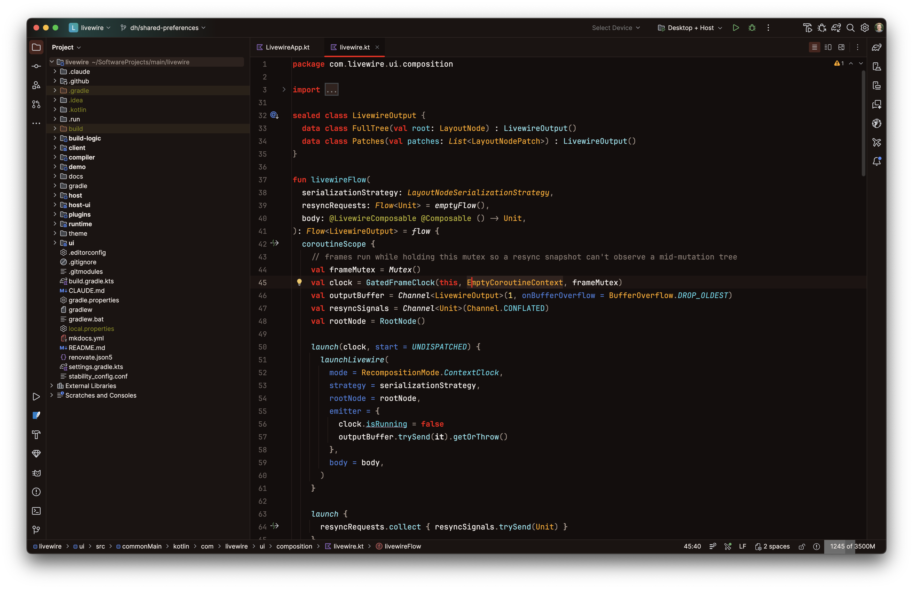
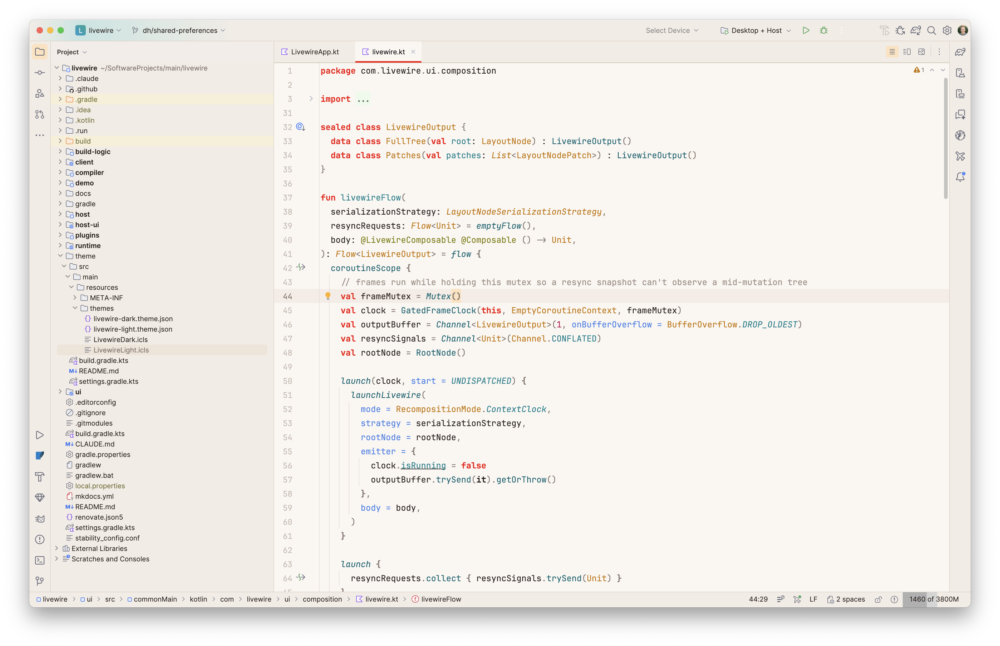

# Livewire IntelliJ Theme

[](https://github.com/livewire-kt/livewire-intellij-theme/actions/workflows/build.yml)

A full IDE theme plugin for JetBrains IDEs (IntelliJ IDEA, Android Studio, etc.)
built around the Livewire brand colors — primary red `#F40B0B` and secondary
orange `#FFA500`.

Includes two themes, each pairing a UI theme with a matching editor color scheme:

- **Livewire Dark** — near-black ember-warm UI, red accents, orange links
- **Livewire Light** — warm paper UI, red accents, burnt-amber links




## Building

```bash
./gradlew buildPlugin
```

The distributable zip lands in `build/distributions/livewire-intellij-theme-<version>.zip`.

## Installing

1. Build the plugin (above), or grab the zip from a release.
2. In the IDE: **Settings → Plugins → ⚙️ → Install Plugin from Disk…** and pick the zip.
3. Restart, then pick **Livewire Dark** or **Livewire Light** under
   **Settings → Appearance & Behavior → Appearance → Theme**.

Selecting a theme automatically applies its matching editor color scheme.

## Development

- UI themes: `src/main/resources/themes/*.theme.json`
- Editor schemes: `src/main/resources/themes/*.icls`
- Test in a sandbox IDE with `./gradlew runIde`

The standalone `.icls` files in the main [livewire](https://github.com/livewire-kt/livewire)
repo (`docs/assets/themes/`) are kept in sync by hand — if you tune colors here,
copy them back there (and vice versa).

## Releasing

Publishing to the [JetBrains Marketplace](https://plugins.jetbrains.com) is
automated via GitHub Actions:

1. Bump `version` in `build.gradle.kts`.
2. Create a GitHub release with a matching tag (e.g. `v1.1.0`).
3. The `Release` workflow signs the plugin, publishes it to the Marketplace,
   and attaches the zip to the GitHub release.

The workflow needs these repository secrets:

- `PUBLISH_TOKEN` — a [Marketplace permanent token](https://plugins.jetbrains.com/docs/marketplace/plugin-upload.html)
- `CERTIFICATE_CHAIN`, `PRIVATE_KEY`, `PRIVATE_KEY_PASSWORD` — [plugin signing](https://plugins.jetbrains.com/docs/intellij/plugin-signing.html) credentials

Note: the very first version of a plugin must be
[uploaded manually](https://plugins.jetbrains.com/plugin/add) via the
Marketplace web UI; `publishPlugin` only works for plugins that already exist
there.
